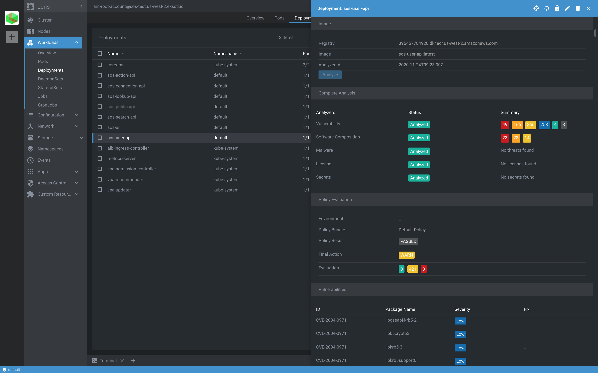
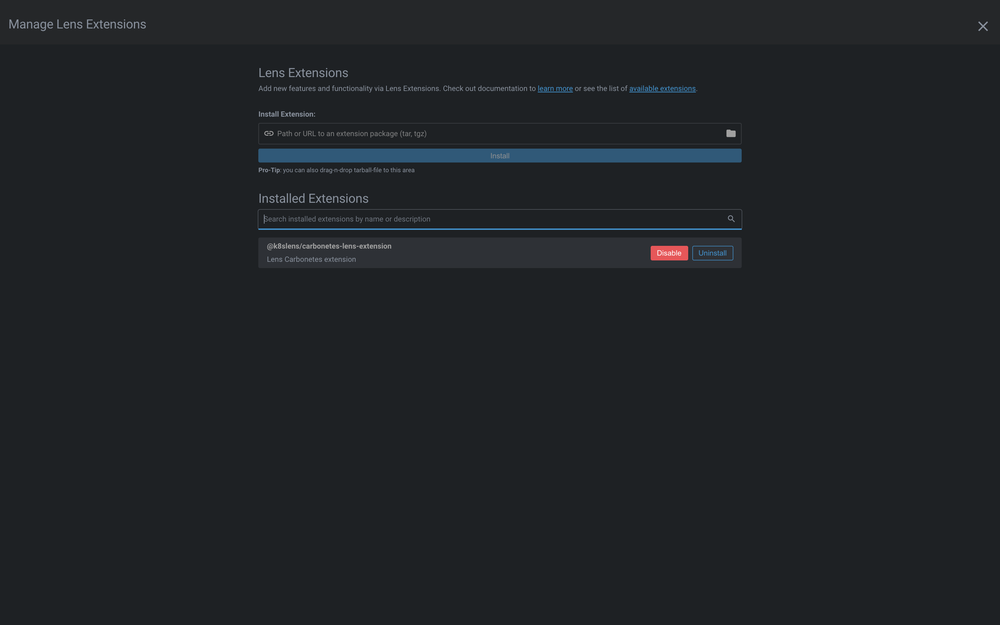
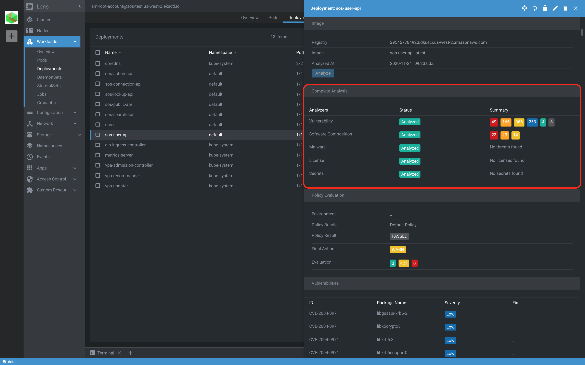
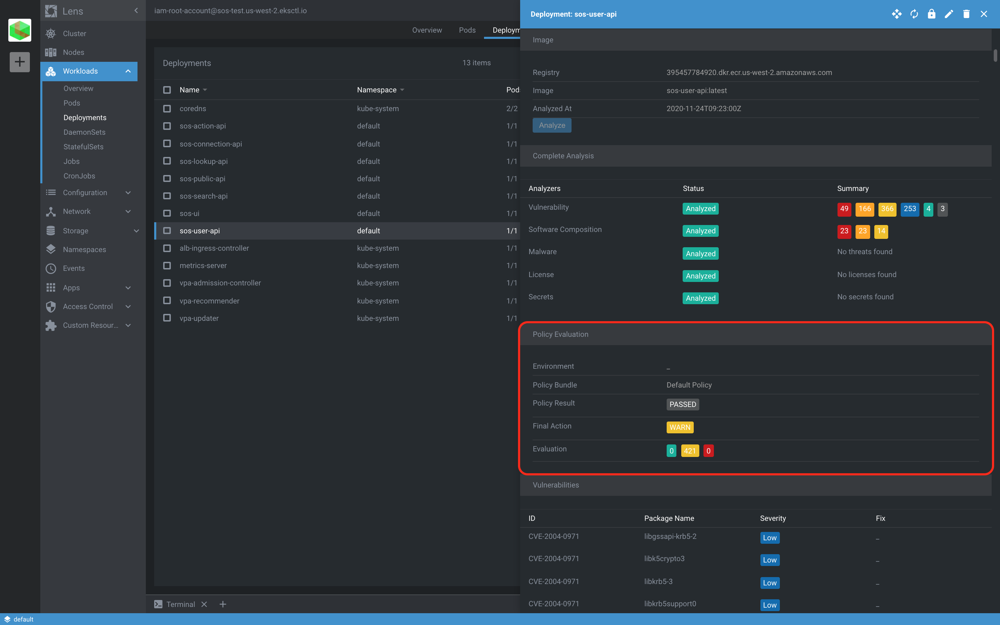
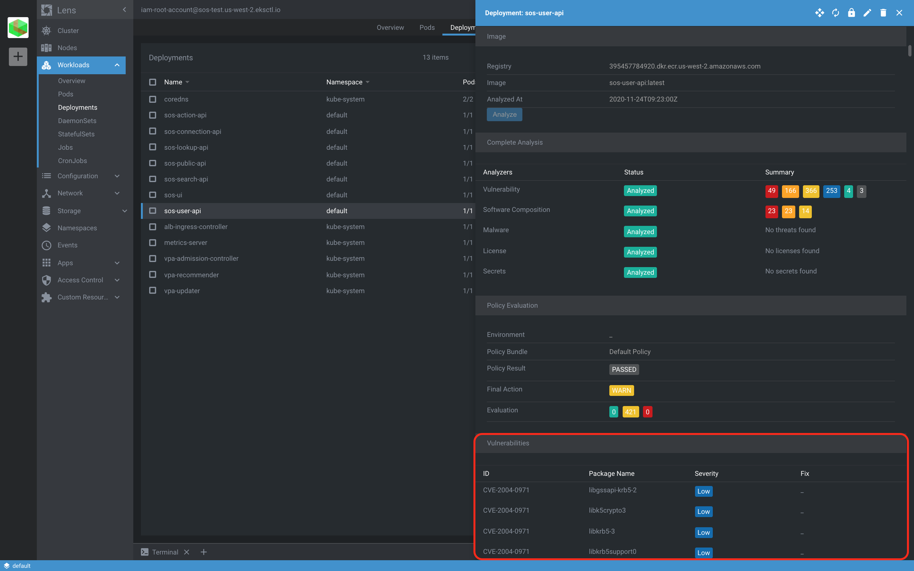

# Carbonetes Lens Extension

This is a [Lens](https://k8slens.dev/) Extension for [Carbonetes](https://carbonetes.com/) provides the most comprehensive and complete Container Application Security Testing (CAST) solution on the market with best-in-class results. 

[](https://youtu.be/X-bhVwmp2l4)

## Prerequisites
* Install [Lens](https://github.com/lensapp/lens/releases/latest) application.
* You need to have a [Carbonetes](https://console.carbonetes.com) account. Sign Up [here](https://console.carbonetes.com/register).

Note: 
Image Analysis can only be used on images that are in container registries added through Carbonetes application


## Install
#### From the Binary Releases
1. Download your desired version from GitHub [release](https://github.com/carbonetes/carbonetes-lens-extension/releases) page. Alternatively, just copy the download URL of the release artifact.
2. Open Lens application and select **Lens** menu, and then click **Extensions** item, or press
   <kbd>Shift</kbd> + <kbd>Command</kbd> + <kbd>E</kbd> to open the **Manage Lens Extensions** page.
3. Specify the path of the extension package `.tar`, `.tgz` or the download URL and click **Install**.
4. If everything is fine, you'll see the `@carbonetes/carbonetes-lens-extension` extension listed under
   **Installed Extensions**. Click **Enable** to enable it.

#### From Source (Linux, macOS)
* You need to have [node](https://nodejs.org/en/) and [npm](https://nodejs.org/en/) installed on your system. It is recommended to use the node version used for Lens development itself which is documented [here](https://github.com/lensapp/lens#development).

1. Clone the source code to the ~/.k8slens/extensions/carbonetes-lens-extensions directory:
```sh
mkdir -p ~/.k8slens/extensions
git clone https://github.com/carbonetes/carbonetes-lens-extension.git
ln -s $(pwd)/carbonetes-lens-extension ~/.k8slens/extensions/carbonetes-lens-extension
```

2. To build the extension you can use `make` or run the `npm` commands manually:

```sh
cd carbonetes-lens-extension
make build
```
or
```sh
cd carbonetes-lens-extension
npm install
npm run build
```
3. Open Lens application and select **Lens** menu, and then click **Extensions** item, or press <kbd>Shift</kbd> + <kbd>Command</kbd> + <kbd>E</kbd> to open the **Manage Lens Extensions** page.

## Getting Started

1. You'll see the @carbonetes/carbonetes-lens-extension extension listed under Installed Extensions. Click Enable to enable it.

2. Image

3. Complete Analysis

4. Policy Evaluation

5. Vulnerabilities


## Uninstall

```sh
rm ~/.k8slens/extensions/carbonetes-lens-extension
```

Restart Lens application.
